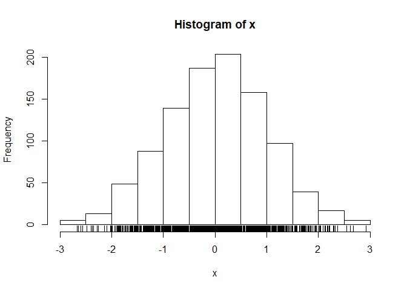

Class05 Data exploration and visualization in R
================
John Smith
2019-10-31

``` r
#Class 05 Data visualization
 x <- rnorm(1000)
 #for rnorm, mean = around 0 and sd = around 1 because its normal distribution (summary stats above)
mean(x)
```

    ## [1] 0.02216199

``` r
sd(x) 
```

    ## [1] 0.9783971

``` r
#summary = min, max, median, mean, Q1, Q3
summary(x)
```

    ##     Min.  1st Qu.   Median     Mean  3rd Qu.     Max. 
    ## -2.67318 -0.65546  0.04149  0.02216  0.70445  2.92520

``` r
#median on bloxplot is the middle line
boxplot(x)
```

<!-- -->

``` r
hist(x)
#adds the tassels at the bottom of the histogram to see where each data point lies
rug(x)
```

<!-- -->

``` r
#real class05 assignment
?read.table()
```

    ## starting httpd help server ... done

``` r
baby <- read.table("bimm143_05_rstats/bimm143_05_rstats/weight_chart.txt",header = TRUE)
#plotting baby as a line graph
plot(baby)
```

<!-- -->

``` r
?plot
plot(baby, type= "o")
```

<!-- -->

``` r
#pch= type of dot plot (can be filled squared, open circle, weird shapes etc)
plot(baby, type = "o", pch=15)
```

<!-- -->

``` r
#cex = dot plot size
plot(baby, type = "o", pch=15, cex= 1.5)
```

<!-- -->

``` r
#lwd = line thickness
plot(baby, type = "o", pch=15, cex= 1.5, lwd=2)
```

<!-- -->

``` r
#ylim = setting the y axis from 2 to 10
plot(baby, type = "o", pch=15, cex= 1.5, lwd=2, ylim= c(2,10))
```

<!-- -->

``` r
#xlab/ylab/main = naming x axis/y axis/whole plot
plot(baby, type = "o", pch=15, cex= 1.5, lwd=2, ylim= c(2,10), xlab= "Age (Months)")
```

<!-- -->

``` r
plot(baby, type = "o", pch=15, cex= 1.5, lwd=2, ylim= c(2,10), xlab= "Age (Months)", ylab= "Weight (kg)")
```

<!-- -->

``` r
#col = change color of 
plot(baby, type = "o", pch=15, cex= 1.5, lwd=2, ylim= c(2,10), xlab= "Age (Months)", ylab= "weight (kg)", main= "Baby weight with age", col= "blue" )
```

<!-- -->

``` r
#plotting feature_counts.txt as a barplot

#you can use either of the 2 bottom ones for the read file. Because delim has default sep = \t and header = true, you can either use delim or use read.table and put those 2 in.
feat <- read.table("bimm143_05_rstats/bimm143_05_rstats/feature_counts.txt", sep= "\t", header = TRUE)

mouse <- read.delim("bimm143_05_rstats/bimm143_05_rstats/feature_counts.txt")

barplot(mouse$Count)
```

<!-- -->

``` r
?par
#par(mar) lets use change the margin length, (use ?par and go to mar to see the specifics)
par(mar=c(5,11,2,2))

barplot(mouse$Count, main = "Number of Features in the Mouse  GRCm38 genome", names.arg = mouse$Feature, horiz = TRUE, las = 1,)
```

<!-- -->

``` r
#section3A COlor
MaleFemale <- read.table("bimm143_05_rstats/bimm143_05_rstats/male_female_counts.txt", header = TRUE, sep = "\t")
#use this to increase the space in the x axis margin. Default = (5,4,4,2), bottom, left, top , right respectively. 
par(mar=c(10,4,2,2))

barplot(MaleFemale$Count, names.arg = MaleFemale$Sample, col= rainbow(nrow(MaleFemale)), las = 2,ylab= "Counts" )
```

<!-- -->

``` r
#instead of rainbow, make it alt blue , red
barplot(MaleFemale$Count, names.arg = MaleFemale$Sample, col= c("blue2","red2"), las = 2,ylab= "Counts" )
```

<!-- -->

``` r
#Section 3B
genes <- read.delim("bimm143_05_rstats/bimm143_05_rstats/up_down_expression.txt")
#nrow(name) to find out how many rows
nrow(genes)
```

    ## [1] 5196
