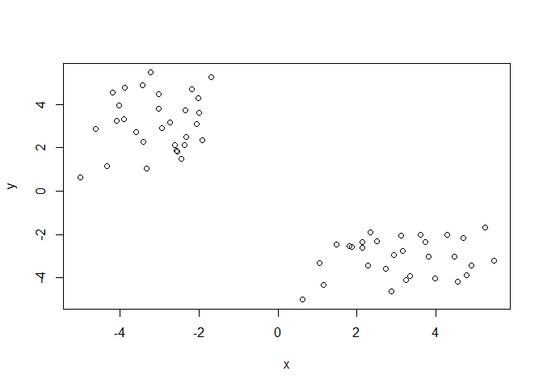
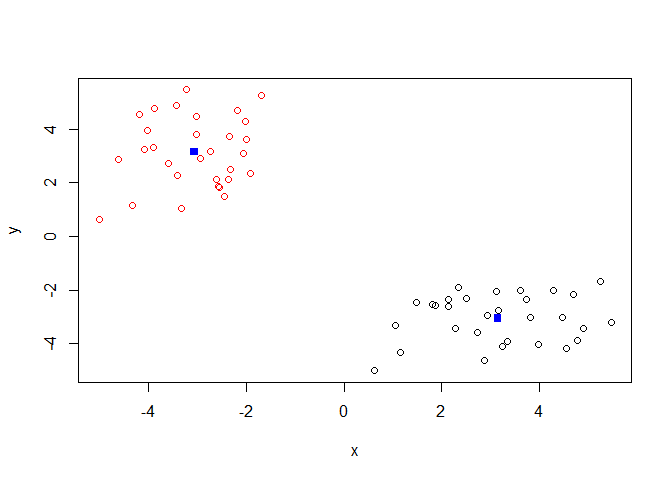
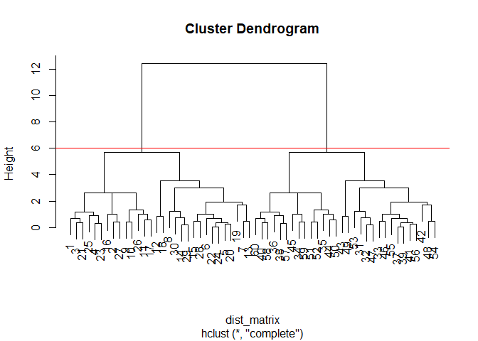
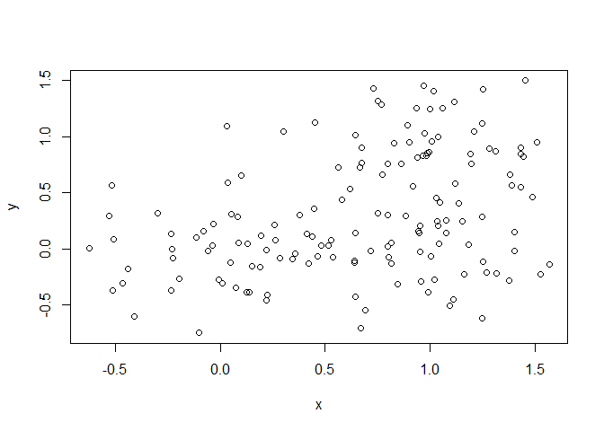
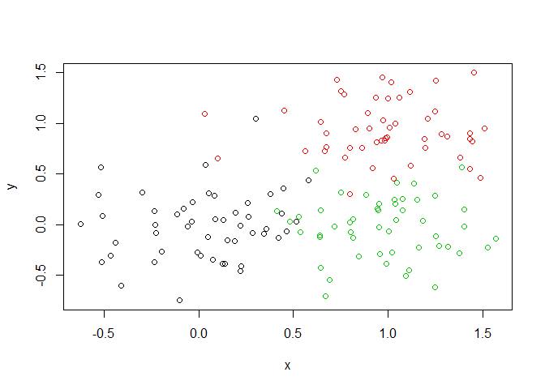
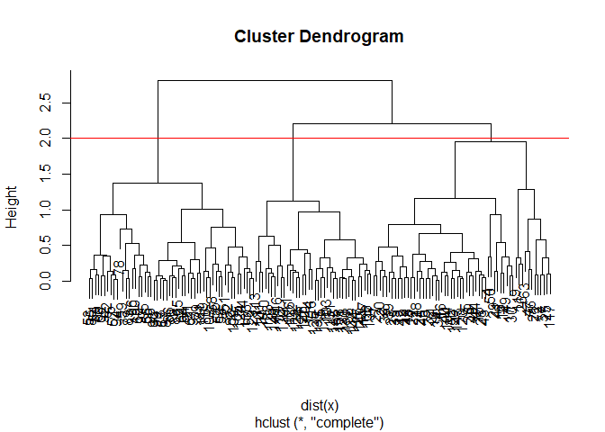
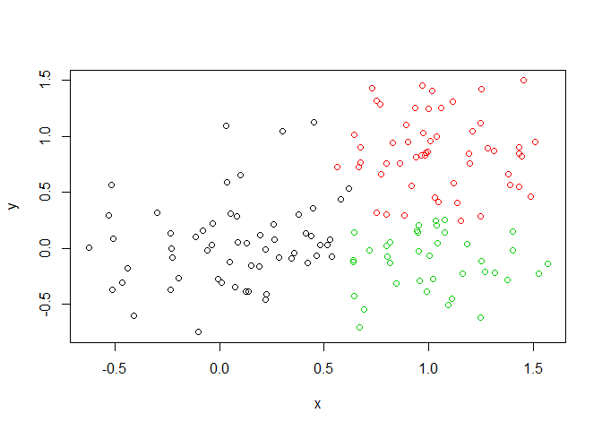

class08
================
Pratik Varade
10/24/2019

Testing out how kmeans works.

``` r
tmp <- c(rnorm(30,-3), rnorm(30,3))
x <- cbind(x=tmp, y=rev(tmp))
plot(x)
```

<!-- -->

Use the kmeans() with k=2, nstart=20

``` r
 k <- kmeans(x, centers =2, nstart=20)
```

Inspect/print results

``` r
k
```

    ## K-means clustering with 2 clusters of sizes 30, 30
    ## 
    ## Cluster means:
    ##           x         y
    ## 1  3.140861 -3.058369
    ## 2 -3.058369  3.140861
    ## 
    ## Clustering vector:
    ##  [1] 2 2 2 2 2 2 2 2 2 2 2 2 2 2 2 2 2 2 2 2 2 2 2 2 2 2 2 2 2 2 1 1 1 1 1
    ## [36] 1 1 1 1 1 1 1 1 1 1 1 1 1 1 1 1 1 1 1 1 1 1 1 1 1
    ## 
    ## Within cluster sum of squares by cluster:
    ## [1] 72.55746 72.55746
    ##  (between_SS / total_SS =  88.8 %)
    ## 
    ## Available components:
    ## 
    ## [1] "cluster"      "centers"      "totss"        "withinss"    
    ## [5] "tot.withinss" "betweenss"    "size"         "iter"        
    ## [9] "ifault"

Q. How many points are in each cluster? 30 in each.

Q. What ‘component’ of your result object details - cluster size? -
cluster assignment/membership? - cluster center?

``` r
k$size
```

    ## [1] 30 30

``` r
k$cluster
```

    ##  [1] 2 2 2 2 2 2 2 2 2 2 2 2 2 2 2 2 2 2 2 2 2 2 2 2 2 2 2 2 2 2 1 1 1 1 1
    ## [36] 1 1 1 1 1 1 1 1 1 1 1 1 1 1 1 1 1 1 1 1 1 1 1 1 1

``` r
k$centers
```

    ##           x         y
    ## 1  3.140861 -3.058369
    ## 2 -3.058369  3.140861

Plot x colored by the kmeans cluster assignment and add cluster centers
as blue points

``` r
plot(x, col = k$cluster)
points(k$centers, col="blue", pch=15)
```

<!-- -->

Hierarchial Clustering in R

The ‘hclust()’ function requires a distance masteix as input. You can
get this from the ‘dist()’ function.

``` r
# First we need to calculate point (dis)similarity
# as the Euclidean distance between observations
dist_matrix <- dist(x)

# The hclust() function returns a hierarchical
# clustering model
hc <- hclust(d = dist_matrix)

# the print method is not so useful here
hc
```

    ## 
    ## Call:
    ## hclust(d = dist_matrix)
    ## 
    ## Cluster method   : complete 
    ## Distance         : euclidean 
    ## Number of objects: 60

``` r
plot(hc)
abline(h=6, col="red")
```

<!-- -->

``` r
cutree(hc, h=6) # Cut by height h
```

    ##  [1] 1 1 1 1 1 1 1 1 1 1 1 1 1 1 1 1 1 1 1 1 1 1 1 1 1 1 1 1 1 1 2 2 2 2 2
    ## [36] 2 2 2 2 2 2 2 2 2 2 2 2 2 2 2 2 2 2 2 2 2 2 2 2 2

``` r
cutree(hc, k=2)
```

    ##  [1] 1 1 1 1 1 1 1 1 1 1 1 1 1 1 1 1 1 1 1 1 1 1 1 1 1 1 1 1 1 1 2 2 2 2 2
    ## [36] 2 2 2 2 2 2 2 2 2 2 2 2 2 2 2 2 2 2 2 2 2 2 2 2 2

Linking Methods// A more real like example

``` r
# Step 1. Generate some example data for clustering
x <- rbind(
 matrix(rnorm(100, mean=0, sd = 0.3), ncol = 2), # c1
 matrix(rnorm(100, mean = 1, sd = 0.3), ncol = 2), # c2
 matrix(c(rnorm(50, mean = 1, sd = 0.3), # c3
 rnorm(50, mean = 0, sd = 0.3)), ncol = 2))
colnames(x) <- c("x", "y")

# Step 2. Plot the data without clustering
plot(x)
```

<!-- -->

``` r
# Step 3. Generate colors for known clusters
# (just so we can compare to hclust results)
col <- as.factor( rep(c("c1","c2","c3"), each=50) )
plot(x, col=col)
```

<!-- -->

Q. Use the dist(), hclust(), plot() and cutree() functions to return 2
and 3 clusters

``` r
#clustering
h<- hclust(dist(x))

#draw tree
plot(h)
abline(h=2,col="red")
```

<!-- -->

``` r
#Cut the tree into clusters/groups
grps <- cutree(h, k=3)
grps
```

    ##   [1] 1 1 1 1 1 1 1 1 1 1 1 1 1 1 1 1 1 1 1 1 1 1 1 1 1 1 1 1 1 1 1 1 1 1 1
    ##  [36] 1 1 1 1 1 1 1 1 1 1 1 1 1 1 1 2 2 2 2 2 2 2 2 2 2 2 2 1 2 2 2 2 2 2 2
    ##  [71] 2 1 2 2 2 1 2 2 2 2 2 2 2 2 2 2 2 2 2 2 2 2 2 2 2 2 2 2 2 2 3 3 3 1 2
    ## [106] 3 2 3 2 3 3 3 3 3 3 3 1 3 2 1 3 3 2 2 3 3 3 3 3 3 3 3 3 3 3 2 3 3 3 3
    ## [141] 3 3 1 3 3 3 3 3 3 1

Plot the data with grps colored

``` r
plot(x, col=grps)
```

<!-- -->

How many points in each cluster

``` r
table(grps)
```

    ## grps
    ##  1  2  3 
    ## 58 54 38

Cross= tablulate ie. compare out clustering result with the known answer

``` r
table(grps, col)
```

    ##     col
    ## grps c1 c2 c3
    ##    1 50  3  5
    ##    2  0 47  7
    ##    3  0  0 38

Principal Component analysis (PCA)

``` r
## You can also download this file from the class website!
mydata <- read.csv("https://tinyurl.com/expression-CSV",
 row.names=1)
head(mydata) 
```

    ##        wt1 wt2  wt3  wt4 wt5 ko1 ko2 ko3 ko4 ko5
    ## gene1  439 458  408  429 420  90  88  86  90  93
    ## gene2  219 200  204  210 187 427 423 434 433 426
    ## gene3 1006 989 1030 1017 973 252 237 238 226 210
    ## gene4  783 792  829  856 760 849 856 835 885 894
    ## gene5  181 249  204  244 225 277 305 272 270 279
    ## gene6  460 502  491  491 493 612 594 577 618 638

How many genes are in this dataset?

``` r
dim(mydata)
```

    ## [1] 100  10

``` r
nrow(mydata)
```

    ## [1] 100

Lets do PCA with the **prcomp** function.

``` r
## lets do PCA
pca <- prcomp(t(mydata), scale=TRUE)
```

What are the attributes of pca?

``` r
## See what is returned by the prcomp() function
attributes(pca)
```

    ## $names
    ## [1] "sdev"     "rotation" "center"   "scale"    "x"       
    ## 
    ## $class
    ## [1] "prcomp"

Lets plot pca1 vs pca2

``` r
## A basic PC1 vs PC2 2-D plot
plot(pca$x[,1], pca$x[,2]) 
```

<!-- -->

``` r
## Precent variance is often more informative to look at
pca.var <- pca$sdev^2
pca.var.per <- round(pca.var/sum(pca.var)*100, 1) 
pca.var.per
```

    ##  [1] 92.6  2.3  1.1  1.1  0.8  0.7  0.6  0.4  0.4  0.0

Make a scree plot with the pca.var.per data

``` r
barplot(pca.var.per, main="Scree Plot",
 xlab="Principal Component", ylab="Percent Variation")
```

<!-- --> Color the
points

``` r
## A vector of colors for wt and ko samples
colvec <- colnames(mydata)
colvec[grep("wt", colvec)] <- "red"
colvec[grep("ko", colvec)] <- "blue"
plot(pca$x[,1], pca$x[,2], col=colvec, pch=16,
 xlab=paste0("PC1 (", pca.var.per[1], "%)"),
 ylab=paste0("PC2 (", pca.var.per[2], "%)")) 
```

<!-- -->

``` r
plot(pca$x[,1], pca$x[,2], col=colvec, pch=16,
 xlab=paste0("PC1 (", pca.var.per[1], "%)"),
 ylab=paste0("PC2 (", pca.var.per[2], "%)"))
## Click to identify which sample is which
identify(pca$x[,1], pca$x[,2], labels=colnames(mydata)) 
```

<!-- -->

    ## integer(0)

Hands On Activity

``` r
x <- read.csv("UK_foods.csv", row.names = 1)
x
```

    ##                     England Wales Scotland N.Ireland
    ## Cheese                  105   103      103        66
    ## Carcass_meat            245   227      242       267
    ## Other_meat              685   803      750       586
    ## Fish                    147   160      122        93
    ## Fats_and_oils           193   235      184       209
    ## Sugars                  156   175      147       139
    ## Fresh_potatoes          720   874      566      1033
    ## Fresh_Veg               253   265      171       143
    ## Other_Veg               488   570      418       355
    ## Processed_potatoes      198   203      220       187
    ## Processed_Veg           360   365      337       334
    ## Fresh_fruit            1102  1137      957       674
    ## Cereals                1472  1582     1462      1494
    ## Beverages                57    73       53        47
    ## Soft_drinks            1374  1256     1572      1506
    ## Alcoholic_drinks        375   475      458       135
    ## Confectionery            54    64       62        41

Q1. How many rows and columns are in your new data frame named x? What R
functions could you use to answer this questions?

``` r
dim(x) #OR
```

    ## [1] 17  4

``` r
nrow(x)
```

    ## [1] 17

``` r
ncol(x)
```

    ## [1] 4

Checking My Data

``` r
View(x)
```

Trying out different Plots

``` r
barplot(as.matrix(x), beside=T, col=rainbow(nrow(x)))
```

<!-- -->

Q3: Changing what optional argument in the above barplot() function
results in the following plot? Change beside = T to beside= F

``` r
barplot(as.matrix(x), beside=F, col=rainbow(nrow(x)))
```

<!-- -->

``` r
pairs(x, col=rainbow(10), pch=16)
```

<!-- --> Q6. What is
the main differences between N. Ireland and the other countries of the
UK in terms of this data-set? Based on the plots above, N. Ireland is a
lot more different than the other 3 counteries. It is not as linear as
the rest.

``` r
# Use the prcomp() PCA function 
pca <- prcomp( t(x) )
summary(pca)
```

    ## Importance of components:
    ##                             PC1      PC2      PC3       PC4
    ## Standard deviation     324.1502 212.7478 73.87622 4.189e-14
    ## Proportion of Variance   0.6744   0.2905  0.03503 0.000e+00
    ## Cumulative Proportion    0.6744   0.9650  1.00000 1.000e+00

``` r
plot (pca$x[,1], pca$x[,2])
```

<!-- -->
