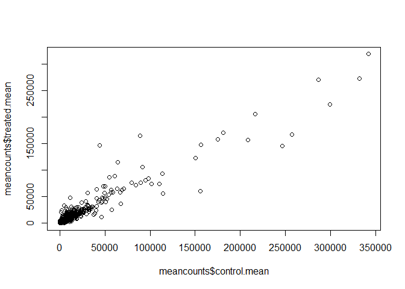
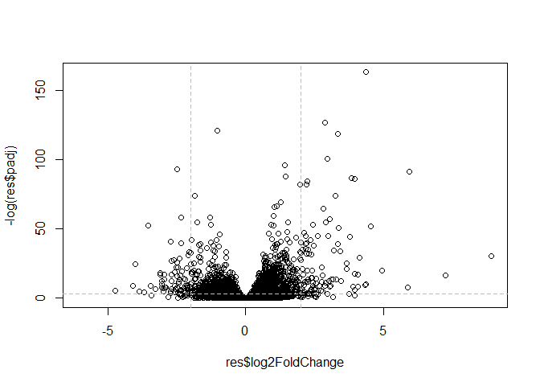
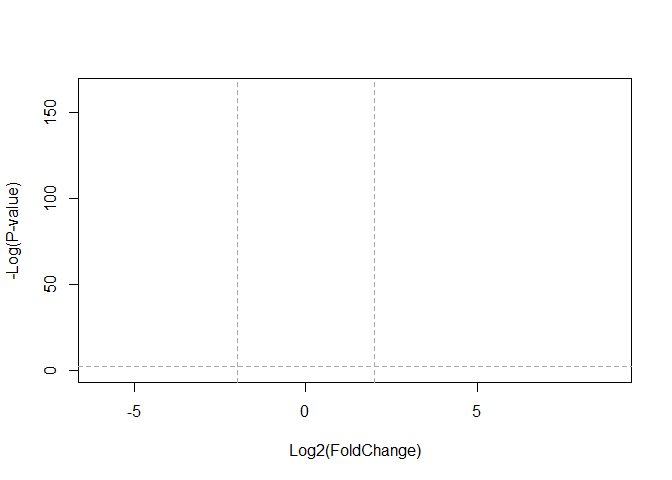

class14
================
Pratik Varade
11/12/2019

## Part 1 : Install Bioconductor/DESeq2 Setup

We will use the DESeq2 package from bioconductor. To install this we ran
**in the console ** —-**Note** eval= FALSE, just so it doesn’t actually
run because I already ran it in console.

``` r
install.packages("BiocManager")
BiocManager::install()
# For this class, you'll also need DESeq2:
BiocManager::install("DESeq2")
```

\#\#Part 2: Import countData and colData

``` r
counts <- read.csv("airway_scaledcounts.csv", stringsAsFactors = FALSE)
metadata <-  read.csv("airway_metadata.csv", stringsAsFactors = FALSE)
```

Take a look at these files :

``` r
head(counts)
```

    ##           ensgene SRR1039508 SRR1039509 SRR1039512 SRR1039513 SRR1039516
    ## 1 ENSG00000000003        723        486        904        445       1170
    ## 2 ENSG00000000005          0          0          0          0          0
    ## 3 ENSG00000000419        467        523        616        371        582
    ## 4 ENSG00000000457        347        258        364        237        318
    ## 5 ENSG00000000460         96         81         73         66        118
    ## 6 ENSG00000000938          0          0          1          0          2
    ##   SRR1039517 SRR1039520 SRR1039521
    ## 1       1097        806        604
    ## 2          0          0          0
    ## 3        781        417        509
    ## 4        447        330        324
    ## 5         94        102         74
    ## 6          0          0          0

``` r
head(metadata)
```

    ##           id     dex celltype     geo_id
    ## 1 SRR1039508 control   N61311 GSM1275862
    ## 2 SRR1039509 treated   N61311 GSM1275863
    ## 3 SRR1039512 control  N052611 GSM1275866
    ## 4 SRR1039513 treated  N052611 GSM1275867
    ## 5 SRR1039516 control  N080611 GSM1275870
    ## 6 SRR1039517 treated  N080611 GSM1275871

How many genes do we have in this data set?

``` r
nrow(counts)
```

    ## [1] 38694

How many exp do we have?

``` r
ncol(counts)
```

    ## [1] 9

Part 3: Toy differential gene expression \#\# perform some exploratory
differential gene expression analysis

``` r
View(metadata)
```

We have to find the mean of all the control groups data. We are doing
this to find out if there is a difference in expression values for
control (non-drug), vs treated (drug added to cell).

First step: Find all the control experiments, and then average all of
them. Then we do the same for all the drug experiments.

``` r
control <- metadata[metadata[,"dex"]=="control",]
control$id
```

    ## [1] "SRR1039508" "SRR1039512" "SRR1039516" "SRR1039520"

Now we can calculate the mean across control columns of **countdata**

``` r
control.mean <- rowSums( counts[ ,control$id] )/length(control$id)
names(control.mean) <- counts$ensgene
```

Now its time to do the same thing for the drug experiments.

``` r
treated <- metadata[metadata[,"dex"]=="treated",]
treated$id
```

    ## [1] "SRR1039509" "SRR1039513" "SRR1039517" "SRR1039521"

Now we can calc the mean across treated columns of countdata.

``` r
treated.mean <- rowSums( counts[ ,treated$id] )/length(treated$id)
names(treated.mean) <- counts$ensgene
```

We will combine our meancount data for bookkeeping purposes.

``` r
meancounts <- data.frame(control.mean, treated.mean)
```

Plot control vs Treated.

``` r
plot(meancounts$control.mean, meancounts$treated.mean)
```

<!-- -->

The plot above is too conjested in the beginning. I need to spread out
the plot so trends can be seen.

``` r
plot(meancounts$control.mean, meancounts$treated.mean, log="xy")
```

    ## Warning in xy.coords(x, y, xlabel, ylabel, log): 15032 x values <= 0
    ## omitted from logarithmic plot

    ## Warning in xy.coords(x, y, xlabel, ylabel, log): 15281 y values <= 0
    ## omitted from logarithmic plot

<!-- -->

Make a log2 function.

``` r
meancounts$log2fc <-log2(meancounts[,"treated.mean"]/meancounts[,"control.mean"])
head(meancounts)
```

    ##                 control.mean treated.mean      log2fc
    ## ENSG00000000003       900.75       658.00 -0.45303916
    ## ENSG00000000005         0.00         0.00         NaN
    ## ENSG00000000419       520.50       546.00  0.06900279
    ## ENSG00000000457       339.75       316.50 -0.10226805
    ## ENSG00000000460        97.25        78.75 -0.30441833
    ## ENSG00000000938         0.75         0.00        -Inf

The NaN and -inf is from doing math with 0’s. We have to filter out the
genes with 0 experession.

``` r
zero.vals <- which(meancounts[,1:2]==0, arr.ind=TRUE)

to.rm <- unique(zero.vals[,1])
mycounts <- meancounts[-to.rm,]
head(mycounts)
```

    ##                 control.mean treated.mean      log2fc
    ## ENSG00000000003       900.75       658.00 -0.45303916
    ## ENSG00000000419       520.50       546.00  0.06900279
    ## ENSG00000000457       339.75       316.50 -0.10226805
    ## ENSG00000000460        97.25        78.75 -0.30441833
    ## ENSG00000000971      5219.00      6687.50  0.35769358
    ## ENSG00000001036      2327.00      1785.75 -0.38194109

**Testing what arr.ind = TRUE does**. It just tells you where on the
dataset the 0 value is. So there are 3 0’s (1, 2, 3), and the
coordinates are given in the row/column.

``` r
x<- data.frame(control=c(56,0,5), treated=c(26,0,0))
x
```

    ##   control treated
    ## 1      56      26
    ## 2       0       0
    ## 3       5       0

``` r
which(x==0, arr.ind = TRUE)
```

    ##      row col
    ## [1,]   2   1
    ## [2,]   2   2
    ## [3,]   3   2

``` r
up.ind <- mycounts$log2fc > 2
down.ind <- mycounts$log2fc < (-2)
```

We sum up.ind because true = 1 and false = 0. So if we add them, we
should get how many are True.

``` r
sum(up.ind)
```

    ## [1] 250

``` r
head(mycounts[up.ind,])
```

    ##                 control.mean treated.mean   log2fc
    ## ENSG00000004799       270.50      1429.25 2.401558
    ## ENSG00000006788         2.75        19.75 2.844349
    ## ENSG00000008438         0.50         2.75 2.459432
    ## ENSG00000011677         0.50         2.25 2.169925
    ## ENSG00000015413         0.50         3.00 2.584963
    ## ENSG00000015592         0.50         2.25 2.169925

Let’s do this the right way. DESeq2 is an R package for analyzing
count-based NGS data like RNA-seq. It is available from Bioconductor.
Bioconductor is a project to provide tools for analyzing high-throughput
genomic data including RNA-seq, ChIP-seq and arrays.

``` r
library(DESeq2)
```

    ## Loading required package: S4Vectors

    ## Loading required package: stats4

    ## Loading required package: BiocGenerics

    ## Loading required package: parallel

    ## 
    ## Attaching package: 'BiocGenerics'

    ## The following objects are masked from 'package:parallel':
    ## 
    ##     clusterApply, clusterApplyLB, clusterCall, clusterEvalQ,
    ##     clusterExport, clusterMap, parApply, parCapply, parLapply,
    ##     parLapplyLB, parRapply, parSapply, parSapplyLB

    ## The following objects are masked from 'package:stats':
    ## 
    ##     IQR, mad, sd, var, xtabs

    ## The following objects are masked from 'package:base':
    ## 
    ##     anyDuplicated, append, as.data.frame, basename, cbind,
    ##     colnames, dirname, do.call, duplicated, eval, evalq, Filter,
    ##     Find, get, grep, grepl, intersect, is.unsorted, lapply, Map,
    ##     mapply, match, mget, order, paste, pmax, pmax.int, pmin,
    ##     pmin.int, Position, rank, rbind, Reduce, rownames, sapply,
    ##     setdiff, sort, table, tapply, union, unique, unsplit, which,
    ##     which.max, which.min

    ## 
    ## Attaching package: 'S4Vectors'

    ## The following object is masked from 'package:base':
    ## 
    ##     expand.grid

    ## Loading required package: IRanges

    ## 
    ## Attaching package: 'IRanges'

    ## The following object is masked from 'package:grDevices':
    ## 
    ##     windows

    ## Loading required package: GenomicRanges

    ## Loading required package: GenomeInfoDb

    ## Loading required package: SummarizedExperiment

    ## Loading required package: Biobase

    ## Welcome to Bioconductor
    ## 
    ##     Vignettes contain introductory material; view with
    ##     'browseVignettes()'. To cite Bioconductor, see
    ##     'citation("Biobase")', and for packages 'citation("pkgname")'.

    ## Loading required package: DelayedArray

    ## Loading required package: matrixStats

    ## 
    ## Attaching package: 'matrixStats'

    ## The following objects are masked from 'package:Biobase':
    ## 
    ##     anyMissing, rowMedians

    ## Loading required package: BiocParallel

    ## 
    ## Attaching package: 'DelayedArray'

    ## The following objects are masked from 'package:matrixStats':
    ## 
    ##     colMaxs, colMins, colRanges, rowMaxs, rowMins, rowRanges

    ## The following objects are masked from 'package:base':
    ## 
    ##     aperm, apply, rowsum

``` r
citation("DESeq2")
```

    ## 
    ##   Love, M.I., Huber, W., Anders, S. Moderated estimation of fold
    ##   change and dispersion for RNA-seq data with DESeq2 Genome
    ##   Biology 15(12):550 (2014)
    ## 
    ## A BibTeX entry for LaTeX users is
    ## 
    ##   @Article{,
    ##     title = {Moderated estimation of fold change and dispersion for RNA-seq data with DESeq2},
    ##     author = {Michael I. Love and Wolfgang Huber and Simon Anders},
    ##     year = {2014},
    ##     journal = {Genome Biology},
    ##     doi = {10.1186/s13059-014-0550-8},
    ##     volume = {15},
    ##     issue = {12},
    ##     pages = {550},
    ##   }

We will use the DESeqDataSetFromMatrix() function to build the required
DESeqDataSet object and call it dds, short for our DESeqDataSet.

``` r
dds <- DESeqDataSetFromMatrix(countData=counts, 
                              colData=metadata, 
                              design=~dex, 
                              tidy=TRUE)
```

    ## converting counts to integer mode

    ## Warning in DESeqDataSet(se, design = design, ignoreRank): some variables in
    ## design formula are characters, converting to factors

``` r
dds
```

    ## class: DESeqDataSet 
    ## dim: 38694 8 
    ## metadata(1): version
    ## assays(1): counts
    ## rownames(38694): ENSG00000000003 ENSG00000000005 ...
    ##   ENSG00000283120 ENSG00000283123
    ## rowData names(0):
    ## colnames(8): SRR1039508 SRR1039509 ... SRR1039520 SRR1039521
    ## colData names(4): id dex celltype geo_id

Run DESEQ2

``` r
dds <- DESeq(dds)
```

    ## estimating size factors

    ## estimating dispersions

    ## gene-wise dispersion estimates

    ## mean-dispersion relationship

    ## final dispersion estimates

    ## fitting model and testing

Look at the results

``` r
res <- results(dds)
res
```

    ## log2 fold change (MLE): dex treated vs control 
    ## Wald test p-value: dex treated vs control 
    ## DataFrame with 38694 rows and 6 columns
    ##                          baseMean     log2FoldChange             lfcSE
    ##                         <numeric>          <numeric>         <numeric>
    ## ENSG00000000003  747.194195359907 -0.350703020686589 0.168245681332903
    ## ENSG00000000005                 0                 NA                NA
    ## ENSG00000000419  520.134160051965  0.206107766417874 0.101059218008481
    ## ENSG00000000457  322.664843927049 0.0245269479387461 0.145145067649738
    ## ENSG00000000460   87.682625164828 -0.147142049222083 0.257007253995456
    ## ...                           ...                ...               ...
    ## ENSG00000283115                 0                 NA                NA
    ## ENSG00000283116                 0                 NA                NA
    ## ENSG00000283119                 0                 NA                NA
    ## ENSG00000283120 0.974916032393564 -0.668258460516795  1.69456285242458
    ## ENSG00000283123                 0                 NA                NA
    ##                               stat             pvalue              padj
    ##                          <numeric>          <numeric>         <numeric>
    ## ENSG00000000003  -2.08446967499072 0.0371174658436988 0.163034808643509
    ## ENSG00000000005                 NA                 NA                NA
    ## ENSG00000000419   2.03947517583776 0.0414026263009679  0.17603166488093
    ## ENSG00000000457  0.168982303952169  0.865810560624016 0.961694238404893
    ## ENSG00000000460 -0.572520996721302  0.566969065259218  0.81584858763974
    ## ...                            ...                ...               ...
    ## ENSG00000283115                 NA                 NA                NA
    ## ENSG00000283116                 NA                 NA                NA
    ## ENSG00000283119                 NA                 NA                NA
    ## ENSG00000283120 -0.394354484733718  0.693319342567684                NA
    ## ENSG00000283123                 NA                 NA                NA

## Making a summary plot (Volcano Plot)

This figure will combine both Change and the p-value into the overview
figure indicating the proportion of genes with large scale significant
difference in their expression.

``` r
#This graph is dull, and hard to read. Add color.
plot(res$log2FoldChange, -log(res$padj))
abline(v=c(-2,2), col="gray", lty=2)
abline(h=-log(0.05), col="gray", lty = 2)
```

<!-- -->

``` r
mycol <- rep("gray", nrow(res))
#make points with +2 -2 fold change blue
mycol [abs(res$log2FoldChange) >2] <- "blue"
#make points below pvalue cutoff red.
plot( res$log2FoldChange,  -log(res$padj), 
 col=res$sig+1, ylab="-Log(P-value)", xlab="Log2(FoldChange)")

# Add some cut-off lines
abline(v=c(-2,2), col="darkgray", lty=2)
abline(h=-log(0.1), col="darkgray", lty=2)
```

<!-- --> Set up some
custom color so we can read the plot better.

``` r
# Setup our custom point color vector 
mycols <- rep("gray", nrow(res))
mycols[ abs(res$log2FoldChange) > 2 ]  <- "red" 

inds <- (res$padj < 0.01) & (abs(res$log2FoldChange) > 2 )
mycols[ inds ] <- "blue"

#Volcano plot with custom colors 
plot( res$log2FoldChange,  -log(res$padj), 
 col=mycols, ylab="-Log(P-value)", xlab="Log2(FoldChange)" )

abline(v=c(-2,2), col="gray", lty=2)
abline(h=-log(0.1), col="gray", lty=2)
```

<!-- -->

Save our results for the next day

``` r
write.csv(res, file="expression_results.csv")
```
