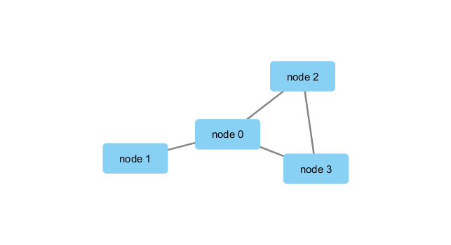

```{r setup, include=FALSE}
knitr::opts_chunk$set(echo = TRUE)
```

## R Markdown

Class 17 Part 2 Hands on Activity
Run librarys necessary (in console)
```{r, eval = FALSE}
library(RCy3)
library(igraph)
library(RColorBrewer)
```

Test that you are connected to cytoscape
```{r}
cytoscapePing()
cytoscapeVersionInfo()
```

```{r}
ge <- makeSimpleIgraph()
createNetworkFromIgraph(ge,"myGraph")
```
This will save the image file from cytoscape.
```{r, eval = FALSE}
fig <- exportImage(filename="demo", type="png", height=350)

```

```{r}


```

Different Styles:
```{r}
setVisualStyle("Marquee")

```
```{r, eval = FALSE}
fig <- exportImage(filename="demo_marquee", type="png", height=350)

```
This is the image:
```{r}
knitr::include_graphics("./demo_marquee.png")

```

What other syles are there?
```{r}
styles <- getVisualStyleNames()
styles
```

```{r}
plot(ge)
```


```{r}
## scripts for processing located in "inst/data-raw/"
prok_vir_cor <- read.delim("virus_prok_cor_abundant.tsv", stringsAsFactors = FALSE)

## Have a peak at the first 6 rows
head(prok_vir_cor)

```

```{r}
g <- graph.data.frame(prok_vir_cor, directed = FALSE)
```

```{r}
class(g)
g
```

```{r}
plot(g)
```

Make it look better
```{r}
plot(g, vertex.label=NA)
```

Make the nodes/vertex smaller
```{r}
plot(g, vertex.size=3, vertex.label=NA)

```


```{r}
createNetworkFromIgraph(g,"myIgraph")
```

```{r}
cb <- cluster_edge_betweenness(g)
```

```{r}
cb
```

```{r}
plot(cb, y=g, vertex.label=NA,  vertex.size=3)
```


```{r}
head( membership(cb) )

```


