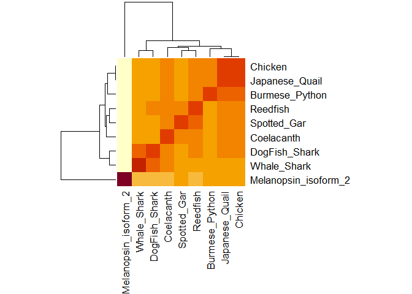

project
================
Pratik Varade
12/1/2019

## R Markdown

``` r
library(bio3d)
```

``` r
y <- read.fasta("out.txt")
y
```

    ##             1        .         .         .         .         .         60 
    ## 162-602_1   FCNNLLMLVLYCKFKRLRTPTNLFLVNISISDLLLSVFGVIFTFVSCVKGRWVWDSAACV
    ##             1        .         .         .         .         .         60 
    ## 
    ##            61        .         .         .         .         .         120 
    ## 162-602_1   WDGFSNCLFGISSIMSLTVLAYERYIRVVNATAIDFSWAWRAITYIWLYSLAWTGAPLIG
    ##            61        .         .         .         .         .         120 
    ## 
    ##           121        .         .      147 
    ## 162-602_1   WNSYTLELHRLGCSVNWDSRNPSDTSF
    ##           121        .         .      147 
    ## 
    ## Call:
    ##   read.fasta(file = "out.txt")
    ## 
    ## Class:
    ##   fasta
    ## 
    ## Alignment dimensions:
    ##   1 sequence rows; 147 position columns (147 non-gap, 0 gap) 
    ## 
    ## + attr: id, ali, call

``` r
x <- read.fasta("sample.fasta")
x
```

    ##                        1        .         .         .         .         50 
    ## Melanopsin_isoform_2   MNPPSGPRVPPSPTQEPSCMATPAPPSWWDSSQSSISSLGRLPSISPTAP
    ## DogFish_Shark          --------------------------------------------------
    ## Whale_Shark            --------------------------------------------------
    ## Spotted_Gar            --------------------------------------------------
    ## Reedfish               --------------------------------------------------
    ## Coelacanth             --------------------------------------------------
    ## Burmese_Python         --------------------------------------------------
    ## Japanese_Quail         --------------------------------------------------
    ## Chicken                --------------------------------------------------
    ##                                                                           
    ##                        1        .         .         .         .         50 
    ## 
    ##                       51        .         .         .         .         100 
    ## Melanopsin_isoform_2   GTWAAAWVPLPTVDVPDHAHYTLGTVILLVGLTGMLGNLTVIYTFCRAVL
    ## DogFish_Shark          ----------------------------------FCNNLLMLVLYCK---
    ## Whale_Shark            -----------------------------------CNNFLMLLLYCK---
    ## Spotted_Gar            ----------------------------------FCNNIIVLVLYYR---
    ## Reedfish               ------------------------------------NNVLVLVLYYK---
    ## Coelacanth             ----------------------------------FCNNLLVLVLYYK---
    ## Burmese_Python         ----------------------------------LCNNLLVLVVYTK---
    ## Japanese_Quail         -----------------------------------CNNLLVLVLYYK---
    ## Chicken                -----------------------------------CNNLLVLVLYYK---
    ##                                                             *  ^^  ^ ^    
    ##                       51        .         .         .         .         100 
    ## 
    ##                      101        .         .         .         .         150 
    ## Melanopsin_isoform_2   RGVTVMMQSRSLRTPANMFIINLAVSDFLMSFTQAPVFFTSSLYKQWLFG
    ## DogFish_Shark          --------FKRLRTPTNLFLVNISISDLLLSVFGVIFTFVSCVKGRWVWD
    ## Whale_Shark            --------FKRLKTPTNLLLVNISISDLLLSVFGVVFTFVSCVRGRWVWD
    ## Spotted_Gar            --------FKRLRTPTNLFLLNISVSDLLVSLFGVNFTFVSCVKGHWIWD
    ## Reedfish               --------FKRLRTPTNLFLLNISISDLLVSVFGVTFTFVSCIKGRWIWD
    ## Coelacanth             --------FKRLRTPTSLLLVNISISDILVSVFGVTFTFLSCLKRRWVWD
    ## Burmese_Python         --------FKRLRTPTNLFLVNISLSDLLVSLFGVSFTFLSCLRNHWAWD
    ## Japanese_Quail         --------FKRLRTPTNLFLVNISLSDLLVSVCGVSLTFMSCLRSRWVWD
    ## Chicken                --------FKRLRTPTNLFLVNISLSDLLVSVCGVSLTFMSCLRSRWVWD
    ##                                 ^ *^**  ^ ^^*^ ^** *^*       * * ^   * ^  
    ##                      101        .         .         .         .         150 
    ## 
    ##                      151        .         .         .         .         200 
    ## Melanopsin_isoform_2   ETGCEFYAFCGALFGISSMITLTAIALDRYL-VITRPLATFGVASKRRAA
    ## DogFish_Shark          SAACVWDGFSNCLFGISSIMSLTVLAYERYIRVVNATAIDFSWAWR----
    ## Whale_Shark            STACVWDGFSKSLFGISSIMSLAVLAYERYIRVVNAKAIDFSWAWR----
    ## Spotted_Gar            SATCVWDGFSNSLFGIVSIMTLTVLAYERYIRVVHAKVIDFTWSWK----
    ## Reedfish               TATCLWDGFSNSLFGIVSIMTLTVLAYERYIRVVHAKVIDFSWSWR----
    ## Coelacanth             NAGCIWDGFSNSLFGIVSIMTLTVLAYERYIRVVHAKVIDFSWTWR----
    ## Burmese_Python         AAGCVWDGFSNSLFGIVSLMTLTVLAYERYIRVVHARVVDFSWSWR----
    ## Japanese_Quail         AAGCVWDGFSNSLFGIVSIMTLTVLAYERYIRVVHAKVIDFSWSWR----
    ## Chicken                AAGCVWDGFSNSLFGIVSIMTLTVLAYERYIRVVHAKVIDFSWSWR----
    ##                           * ^ ^*   **** *^^^*  ^* ^**^ *^      *    ^     
    ##                      151        .         .         .         .         200 
    ## 
    ##                      201        .         .         .         .         250 
    ## Melanopsin_isoform_2   FVLLGVWLYALAWSLPPFFGWSAYVPEGLLTSCSWDYMSFTPAVRAYTML
    ## DogFish_Shark          -AITYIWLYSLAWTGAPLIGWNSYTLELHRLGCSVNWDSRNPSDTSF---
    ## Whale_Shark            -AITYIWLYSLAWSGAPLIGWNRYSLELHKLGCSVNWDSRNPSDTSY---
    ## Spotted_Gar            -AIAYIWLYSLAWTGAPLIGWNRYTLERHRLGCSVDWGSKDPNDASF---
    ## Reedfish               -AITYIWLYSLAWTGAPLIGWNKYTLEKHRLGCSVDWESKDANDAS----
    ## Coelacanth             -AITYIWLYSLGWTGAPLIGWNRYSLEIHKLGCSVDWDSKDPNDASF---
    ## Burmese_Python         -AITYIWLYSLAWTGAPLLGWNHYTLELHGLGCSVDWSSREPGDTSF---
    ## Japanese_Quail         -AITYIWLYSLAWTGAPLLGWNRYTLEIHGLGCSMDWKSKDPNDTSF---
    ## Chicken                -AITYIWLYSLAWTGAPLLGWNRYTLEIHGLGCSMDWKSKDPNDTSF---
    ##                          ^  ^*** *^*^  *  **  *  *     **  ^ *            
    ##                      201        .         .         .         .         250 
    ## 
    ##                      251        .         .         .         .         300 
    ## Melanopsin_isoform_2   LCCFVFFLPLLIIIYCYIFIFRAIRETGRALQTFGACKGNGESLWQRQRL
    ## DogFish_Shark          --------------------------------------------------
    ## Whale_Shark            --------------------------------------------------
    ## Spotted_Gar            --------------------------------------------------
    ## Reedfish               --------------------------------------------------
    ## Coelacanth             --------------------------------------------------
    ## Burmese_Python         --------------------------------------------------
    ## Japanese_Quail         --------------------------------------------------
    ## Chicken                --------------------------------------------------
    ##                                                                           
    ##                      251        .         .         .         .         300 
    ## 
    ##                      301        .         .         .         .         350 
    ## Melanopsin_isoform_2   QSECKMAKIMLLVILLFVLSWAPYSAVALVAFAGYAHVLTPYMSSVPAVI
    ## DogFish_Shark          --------------------------------------------------
    ## Whale_Shark            --------------------------------------------------
    ## Spotted_Gar            --------------------------------------------------
    ## Reedfish               --------------------------------------------------
    ## Coelacanth             --------------------------------------------------
    ## Burmese_Python         --------------------------------------------------
    ## Japanese_Quail         --------------------------------------------------
    ## Chicken                --------------------------------------------------
    ##                                                                           
    ##                      301        .         .         .         .         350 
    ## 
    ##                      351        .         .         .         .         400 
    ## Melanopsin_isoform_2   AKASAIHNPIIYAITHPKYRVAIAQHLPCLGVLLGVSRRHSRPYPSYRST
    ## DogFish_Shark          --------------------------------------------------
    ## Whale_Shark            --------------------------------------------------
    ## Spotted_Gar            --------------------------------------------------
    ## Reedfish               --------------------------------------------------
    ## Coelacanth             --------------------------------------------------
    ## Burmese_Python         --------------------------------------------------
    ## Japanese_Quail         --------------------------------------------------
    ## Chicken                --------------------------------------------------
    ##                                                                           
    ##                      351        .         .         .         .         400 
    ## 
    ##                      401        .         .         .         .         450 
    ## Melanopsin_isoform_2   HRSTLTSHTSNLSWISIRRRQESLGSESEVGWTHMEAAAVWGAAQQANGR
    ## DogFish_Shark          --------------------------------------------------
    ## Whale_Shark            --------------------------------------------------
    ## Spotted_Gar            --------------------------------------------------
    ## Reedfish               --------------------------------------------------
    ## Coelacanth             --------------------------------------------------
    ## Burmese_Python         --------------------------------------------------
    ## Japanese_Quail         --------------------------------------------------
    ## Chicken                --------------------------------------------------
    ##                                                                           
    ##                      401        .         .         .         .         450 
    ## 
    ##                      451        .         .         .         490 
    ## Melanopsin_isoform_2   SLYGQGLEDLEAKAPPRPQGHEAETPGKTKGLIPSQDPRM
    ## DogFish_Shark          ----------------------------------------
    ## Whale_Shark            ----------------------------------------
    ## Spotted_Gar            ----------------------------------------
    ## Reedfish               ----------------------------------------
    ## Coelacanth             ----------------------------------------
    ## Burmese_Python         ----------------------------------------
    ## Japanese_Quail         ----------------------------------------
    ## Chicken                ----------------------------------------
    ##                                                                 
    ##                      451        .         .         .         490 
    ## 
    ## Call:
    ##   read.fasta(file = "sample.fasta")
    ## 
    ## Class:
    ##   fasta
    ## 
    ## Alignment dimensions:
    ##   9 sequence rows; 490 position columns (143 non-gap, 347 gap) 
    ## 
    ## + attr: id, ali, call

``` r
data <- seqidentity(x)
```

``` r
heatmap(data, margins = c(11,11))
```

<!-- -->

``` r
consensus(data)
```

    ## Warning in consensus(data): 
    ## non standard residue code: 0.322 maped to X
    ## non standard residue code: 0.324 maped to X
    ## non standard residue code: 0.329 maped to X
    ## non standard residue code: 0.342 maped to X
    ## non standard residue code: 0.345 maped to X
    ## non standard residue code: 0.733 maped to X
    ## non standard residue code: 0.753 maped to X
    ## non standard residue code: 0.757 maped to X
    ## non standard residue code: 0.774 maped to X
    ## non standard residue code: 0.782 maped to X
    ## non standard residue code: 0.789 maped to X
    ## non standard residue code: 0.795 maped to X
    ## non standard residue code: 0.796 maped to X
    ## non standard residue code: 0.799 maped to X
    ## non standard residue code: 0.812 maped to X
    ## non standard residue code: 0.816 maped to X
    ## non standard residue code: 0.822 maped to X
    ## non standard residue code: 0.847 maped to X
    ## non standard residue code: 0.861 maped to X
    ## non standard residue code: 0.863 maped to X
    ## non standard residue code: 0.87 maped to X
    ## non standard residue code: 0.882 maped to X
    ## non standard residue code: 0.89 maped to X
    ## non standard residue code: 1 maped to X

    ## $seq
    ## [1] "-" "-" "-" "-" "-" "-" "-" "-" "-"
    ## 
    ## $freq
    ##   1 2 3 4 5 6 7 8 9
    ## V 0 0 0 0 0 0 0 0 0
    ## I 0 0 0 0 0 0 0 0 0
    ## L 0 0 0 0 0 0 0 0 0
    ## M 0 0 0 0 0 0 0 0 0
    ## F 0 0 0 0 0 0 0 0 0
    ## W 0 0 0 0 0 0 0 0 0
    ## Y 0 0 0 0 0 0 0 0 0
    ## S 0 0 0 0 0 0 0 0 0
    ## T 0 0 0 0 0 0 0 0 0
    ## N 0 0 0 0 0 0 0 0 0
    ## Q 0 0 0 0 0 0 0 0 0
    ## H 0 0 0 0 0 0 0 0 0
    ## K 0 0 0 0 0 0 0 0 0
    ## R 0 0 0 0 0 0 0 0 0
    ## D 0 0 0 0 0 0 0 0 0
    ## E 0 0 0 0 0 0 0 0 0
    ## A 0 0 0 0 0 0 0 0 0
    ## G 0 0 0 0 0 0 0 0 0
    ## P 0 0 0 0 0 0 0 0 0
    ## C 0 0 0 0 0 0 0 0 0
    ## - 0 0 0 0 0 0 0 0 0
    ## X 1 1 1 1 1 1 1 1 1
    ## 
    ## $seq.freq
    ## 1 2 3 4 5 6 7 8 9 
    ## 0 0 0 0 0 0 0 0 0 
    ## 
    ## $cutoff
    ## [1] 0.6

``` r
blast.pdb(y)
```

    ##  Searching ... please wait (updates every 5 seconds) RID = YDEYYV3U014 
    ##  ...
    ##  Reporting 100 hits

    ## $hit.tbl
    ##         queryid subjectids identity alignmentlength mismatches gapopens
    ## 1   Query_49219     4WW3_A   33.803             142         89        2
    ## 2   Query_49219     2ZIY_A   33.803             142         89        2
    ## 3   Query_49219     2Z73_A   33.803             142         89        2
    ## 4   Query_49219     6FK6_A   30.822             146         96        2
    ## 5   Query_49219     6FUF_A   30.872             149         98        2
    ## 6   Query_49219     6FKB_A   30.872             149         98        2
    ## 7   Query_49219     3C9M_A   30.872             149         98        2
    ## 8   Query_49219     6QNO_R   30.872             149         98        2
    ## 9   Query_49219     4A4M_A   30.872             149         98        2
    ## 10  Query_49219     2J4Y_A   30.872             149         98        2
    ## 11  Query_49219     1JFP_A   30.872             149         98        2
    ## 12  Query_49219     3OAX_A   30.872             149         98        2
    ## 13  Query_49219     2X72_A   30.872             149         98        2
    ## 14  Query_49219     5DYS_A   30.201             149         99        2
    ## 15  Query_49219     4BEZ_A   30.201             149         99        2
    ## 16  Query_49219     6I9K_A   29.927             137         93        1
    ## 17  Query_49219     4ZWJ_A   30.822             146         96        2
    ## 18  Query_49219     5W0P_A   30.822             146         96        2
    ## 19  Query_49219     5W0P_C   30.822             146         96        2
    ## 20  Query_49219     6CMO_R   30.822             146         96        2
    ## 21  Query_49219     5ZBQ_A   31.746             126         83        2
    ## 22  Query_49219     5ZBH_A   31.746             126         83        2
    ## 23  Query_49219     6J21_A   26.772             127         92        1
    ## 24  Query_49219     2KS9_A   25.984             127         93        1
    ## 25  Query_49219     6E59_A   25.984             127         93        1
    ## 26  Query_49219     6J20_A   25.984             127         93        1
    ## 27  Query_49219     6HLL_A   25.984             127         93        1
    ## 28  Query_49219     6HLO_A   25.984             127         93        1
    ## 29  Query_49219     4IAR_A   24.648             142         98        3
    ## 30  Query_49219     4IAQ_A   24.648             142         98        3
    ## 31  Query_49219     6G79_S   24.648             142         98        3
    ## 32  Query_49219     6IBL_A   31.111              90         60        2
    ## 33  Query_49219     5V54_A   24.648             142         98        3
    ## 34  Query_49219     2Y00_A   31.461              89         59        2
    ## 35  Query_49219     2VT4_A   31.461              89         59        2
    ## 36  Query_49219     6H7J_A   31.461              89         59        2
    ## 37  Query_49219     6ME8_A   26.667              90         66        0
    ## 38  Query_49219     4BVN_A   30.337              89         60        2
    ## 39  Query_49219     5A8E_A   30.337              89         60        2
    ## 40  Query_49219     3V2W_A   28.800             125         81        3
    ## 41  Query_49219     6ME6_A   25.556              90         67        0
    ## 42  Query_49219     6ME7_A   25.556              90         67        0
    ## 43  Query_49219     6ME2_A   24.561             114         82        1
    ## 44  Query_49219     5YHL_A   19.205             151        116        2
    ## 45  Query_49219     6ME3_A   24.561             114         82        1
    ## 46  Query_49219     6GPX_A   25.472             106         72        4
    ## 47  Query_49219     6GPS_A   25.472             106         72        4
    ## 48  Query_49219     5TUD_A   26.957             115         78        4
    ## 49  Query_49219     6A93_A   26.667              90         65        1
    ## 50  Query_49219     3RZE_A   24.219             128         92        3
    ## 51  Query_49219     6BQG_A   29.762              84         44        4
    ## 52  Query_49219     5T1A_A   25.472             106         72        4
    ## 53  Query_49219     4GBR_A   27.907              86         62        0
    ## 54  Query_49219     3KJ6_A   27.273              88         64        0
    ## 55  Query_49219     2R4R_A   27.907              86         62        0
    ## 56  Query_49219     4U15_A   26.744              86         61        2
    ## 57  Query_49219     6MXT_A   29.268              82         58        0
    ## 58  Query_49219     4DAJ_A   26.744              86         61        2
    ## 59  Query_49219     4LDE_A   29.268              82         58        0
    ## 60  Query_49219     6E67_A   29.268              82         58        0
    ## 61  Query_49219     4U14_A   26.744              86         61        2
    ## 62  Query_49219     2R4S_A   27.907              86         62        0
    ## 63  Query_49219     6NI3_R   29.268              82         58        0
    ## 64  Query_49219     6QZH_A   28.261              92         60        4
    ## 65  Query_49219     5JQH_A   29.268              82         58        0
    ## 66  Query_49219     3SN6_R   29.268              82         58        0
    ## 67  Query_49219     5MZJ_A   26.154             130         78        4
    ## 68  Query_49219     3PWH_A   25.000             136         79        4
    ## 69  Query_49219     5IU4_A   26.154             130         78        4
    ## 70  Query_49219     3P0G_A   29.268              82         58        0
    ## 71  Query_49219     5TVN_A   26.087             115         79        3
    ## 72  Query_49219     2RH1_A   29.268              82         58        0
    ## 73  Query_49219     6DRX_A   26.087             115         79        3
    ## 74  Query_49219     6DRY_A   26.087             115         79        3
    ## 75  Query_49219     6DRZ_A   26.087             115         79        3
    ## 76  Query_49219     4IB4_A   26.087             115         79        3
    ## 77  Query_49219     6OIJ_R   25.556              90         65        2
    ## 78  Query_49219     4QKX_A   29.268              82         58        0
    ## 79  Query_49219     3PDS_A   29.268              82         58        0
    ## 80  Query_49219     5CXV_A   26.437              87         62        2
    ## 81  Query_49219     4S0V_A   27.027             111         77        2
    ## 82  Query_49219     5WQC_A   27.027             111         77        2
    ## 83  Query_49219     6PRZ_A   29.268              82         58        0
    ## 84  Query_49219     3D4S_A   29.268              82         58        0
    ## 85  Query_49219     5ZHP_A   25.581              86         62        2
    ## 86  Query_49219     6AK3_B   28.777             139         83        8
    ## 87  Query_49219     5DSG_A   25.301              83         60        2
    ## 88  Query_49219     4ZUD_A   22.603             146        107        3
    ## 89  Query_49219     4YAY_A   22.603             146        107        3
    ## 90  Query_49219     4EIY_A   28.696             115         68        5
    ## 91  Query_49219     6JZH_A   28.696             115         68        5
    ## 92  Query_49219     6PS7_A   28.696             115         68        5
    ## 93  Query_49219     6AKX_A   26.415             106         71        3
    ## 94  Query_49219     4MBS_A   39.394              33         20        0
    ## 95  Query_49219     2YDO_A   24.603             126         85        3
    ## 96  Query_49219     5UIW_A   39.394              33         20        0
    ## 97  Query_49219     5UIG_A   28.070             114         70        4
    ## 98  Query_49219     6DO1_A   22.603             146        107        3
    ## 99  Query_49219     4MQS_A   26.506              83         59        2
    ## 100 Query_49219     3UON_A   26.506              83         59        2
    ##     q.start q.end s.start s.end   evalue bitscore positives mlog.evalue
    ## 1        10   146      50   191 3.91e-20     85.5     54.93   44.688164
    ## 2        10   146      57   198 4.85e-20     85.5     54.93   44.472723
    ## 3        10   146      58   199 7.67e-20     85.1     54.93   44.014385
    ## 4         4   146      56   199 3.16e-17     77.4     50.00   37.993375
    ## 5         1   146      51   197 3.26e-17     77.0     49.66   37.962219
    ## 6         1   146      53   199 3.56e-17     77.0     49.66   37.874186
    ## 7         1   146      52   198 3.83e-17     77.0     49.66   37.801082
    ## 8         1   146      52   198 3.83e-17     77.0     49.66   37.801082
    ## 9         1   146      53   199 3.85e-17     77.0     49.66   37.795873
    ## 10        1   146      53   199 3.85e-17     77.0     49.66   37.795873
    ## 11        1   146      52   198 4.03e-17     77.0     49.66   37.750180
    ## 12        1   146      53   199 4.05e-17     77.0     49.66   37.745230
    ## 13        1   146      53   199 7.10e-17     76.6     48.99   37.183852
    ## 14        1   146      53   199 2.29e-16     75.1     48.99   36.012810
    ## 15        1   146      53   199 5.18e-16     73.9     48.99   35.196556
    ## 16        4   137      68   204 4.45e-14     68.9     51.09   30.743287
    ## 17        1   142     212   356 8.65e-14     68.2     51.37   30.078632
    ## 18        1   142     212   356 8.65e-14     68.2     51.37   30.078632
    ## 19        1   142     212   356 8.65e-14     68.2     51.37   30.078632
    ## 20        1   142     192   336 6.67e-13     65.5     51.37   28.035986
    ## 21        4   127      57   181 7.21e-13     65.5     54.76   27.958137
    ## 22        4   127      67   191 7.50e-13     65.5     54.76   27.918703
    ## 23       15   140      60   186 2.39e-08     52.4     46.46   17.549387
    ## 24       15   140      61   187 2.70e-08     52.4     46.46   17.427429
    ## 25       15   140      61   187 5.13e-08     51.6     46.46   16.785575
    ## 26       15   140      60   186 1.48e-07     50.1     46.46   15.726054
    ## 27       15   140      61   187 1.89e-06     47.0     45.67   13.178934
    ## 28       15   140      61   187 2.22e-06     46.6     45.67   13.018003
    ## 29        3   138      37   175 7.22e-06     45.1     47.89   11.838656
    ## 30        3   138      37   175 7.66e-06     45.1     47.89   11.779499
    ## 31        3   138      34   172 7.97e-06     45.1     47.89   11.739826
    ## 32        2    90     128   216 8.33e-06     45.1     57.78   11.695647
    ## 33        3   138      30   168 8.46e-06     45.1     47.89   11.680161
    ## 34        3    90      28   115 9.20e-06     44.7     58.43   11.596307
    ## 35        3    90      28   115 1.00e-05     44.7     58.43   11.512925
    ## 36        3    90      20   107 1.23e-05     44.3     58.43   11.305911
    ## 37        4    93     134   223 1.50e-05     44.3     55.56   11.107460
    ## 38        3    90      28   115 1.57e-05     44.3     58.43   11.061850
    ## 39        3    90      28   115 3.48e-05     43.1     58.43   10.265893
    ## 40        3   122      80   201 3.80e-05     43.1     47.20   10.177924
    ## 41        4    93     134   223 8.03e-05     42.4     55.56    9.429741
    ## 42        4    93     134   223 8.03e-05     42.4     55.56    9.429741
    ## 43        3   112      35   148 1.45e-04     41.6     53.51    8.838777
    ## 44        3   147      34   184 2.05e-04     40.8     46.36    8.492501
    ## 45        3   112      35   148 2.16e-04     40.8     53.51    8.440232
    ## 46        1   105      29   128 2.25e-04     40.8     55.66    8.399410
    ## 47        1   105      56   155 2.73e-04     40.8     55.66    8.206039
    ## 48        3   112      63   176 3.04e-04     40.4     53.91    8.098483
    ## 49        2    90      24   113 1.00e-03     39.3     54.44    6.907755
    ## 50        4   127      26   152 2.00e-03     38.1     46.88    6.214608
    ## 51       15    90      69   145 2.00e-03     38.1     52.38    6.214608
    ## 52        1   105      67   166 3.00e-03     37.7     54.72    5.809143
    ## 53        3    88      22   107 3.00e-03     37.7     54.65    5.809143
    ## 54        3    90      51   138 3.00e-03     37.4     54.55    5.809143
    ## 55        3    88      50   135 4.00e-03     37.4     54.65    5.521461
    ## 56        4    88      30   114 4.00e-03     37.4     58.14    5.521461
    ## 57        4    85     186   267 4.00e-03     37.4     56.10    5.521461
    ## 58        4    88      30   114 4.00e-03     37.4     58.14    5.521461
    ## 59        4    85     200   281 4.00e-03     37.4     56.10    5.521461
    ## 60        4    85      75   156 4.00e-03     37.4     56.10    5.521461
    ## 61        4    88      30   114 4.00e-03     37.4     58.14    5.521461
    ## 62        3    88      27   112 4.00e-03     37.4     54.65    5.521461
    ## 63        4    85     216   297 4.00e-03     37.4     56.10    5.521461
    ## 64        4    93      35   122 4.00e-03     37.4     55.43    5.521461
    ## 65        4    85     200   281 4.00e-03     37.4     56.10    5.521461
    ## 66        4    85     200   281 4.00e-03     37.4     56.10    5.521461
    ## 67       17   134      47   170 4.00e-03     37.4     43.08    5.521461
    ## 68       17   144      37   157 4.00e-03     37.0     41.91    5.521461
    ## 69       17   134      46   169 4.00e-03     37.0     43.08    5.521461
    ## 70        4    85      59   140 5.00e-03     37.0     56.10    5.298317
    ## 71        3   112      32   145 5.00e-03     37.0     52.17    5.298317
    ## 72        4    85      58   139 5.00e-03     37.0     56.10    5.298317
    ## 73        3   112      37   150 5.00e-03     37.0     52.17    5.298317
    ## 74        3   112      37   150 5.00e-03     37.0     52.17    5.298317
    ## 75        3   112      37   150 5.00e-03     37.0     52.17    5.298317
    ## 76        3   112      47   160 6.00e-03     37.0     52.17    5.115996
    ## 77        3    91      51   139 6.00e-03     36.6     53.33    5.115996
    ## 78        4    85     200   281 7.00e-03     36.6     56.10    4.961845
    ## 79        4    85      27   108 8.00e-03     36.6     56.10    4.828314
    ## 80        3    88      67   152 8.00e-03     36.6     55.17    4.828314
    ## 81        3   110      77   186 9.00e-03     36.2     51.35    4.710531
    ## 82        3   110      78   187 9.00e-03     36.2     51.35    4.710531
    ## 83        4    85      75   156 1.30e-02     35.8     56.10    4.342806
    ## 84        4    85      59   140 1.30e-02     35.8     56.10    4.342806
    ## 85        4    88      30   114 1.40e-02     35.8     56.98    4.268698
    ## 86        3   127      28   164 1.60e-02     35.4     50.36    4.135167
    ## 87        4    85      31   112 1.60e-02     35.4     57.83    4.135167
    ## 88        1   141     139   283 3.40e-02     34.7     50.68    3.381395
    ## 89        1   141     139   283 3.50e-02     34.7     50.68    3.352407
    ## 90       17   123      62   170 3.60e-02     34.7     46.96    3.324236
    ## 91       17   123      62   170 3.60e-02     34.7     46.96    3.324236
    ## 92       17   123      57   165 3.70e-02     34.3     46.96    3.296837
    ## 93        1   105      47   146 4.00e-02     34.3     51.89    3.218876
    ## 94        1    33      47    79 4.30e-02     34.3     81.82    3.146555
    ## 95       17   134      37   160 4.40e-02     34.3     42.86    3.123566
    ## 96        1    33      47    79 4.60e-02     34.3     81.82    3.079114
    ## 97       17   123      63   171 4.80e-02     34.3     46.49    3.036554
    ## 98        1   141      51   195 5.20e-02     33.9     50.68    2.956512
    ## 99        4    85      58   139 7.90e-02     33.5     54.22    2.538307
    ## 100       4    85      41   122 8.10e-02     33.5     55.42    2.513306
    ##     pdb.id    acc
    ## 1   4WW3_A 4WW3_A
    ## 2   2ZIY_A 2ZIY_A
    ## 3   2Z73_A 2Z73_A
    ## 4   6FK6_A 6FK6_A
    ## 5   6FUF_A 6FUF_A
    ## 6   6FKB_A 6FKB_A
    ## 7   3C9M_A 3C9M_A
    ## 8   6QNO_R 6QNO_R
    ## 9   4A4M_A 4A4M_A
    ## 10  2J4Y_A 2J4Y_A
    ## 11  1JFP_A 1JFP_A
    ## 12  3OAX_A 3OAX_A
    ## 13  2X72_A 2X72_A
    ## 14  5DYS_A 5DYS_A
    ## 15  4BEZ_A 4BEZ_A
    ## 16  6I9K_A 6I9K_A
    ## 17  4ZWJ_A 4ZWJ_A
    ## 18  5W0P_A 5W0P_A
    ## 19  5W0P_C 5W0P_C
    ## 20  6CMO_R 6CMO_R
    ## 21  5ZBQ_A 5ZBQ_A
    ## 22  5ZBH_A 5ZBH_A
    ## 23  6J21_A 6J21_A
    ## 24  2KS9_A 2KS9_A
    ## 25  6E59_A 6E59_A
    ## 26  6J20_A 6J20_A
    ## 27  6HLL_A 6HLL_A
    ## 28  6HLO_A 6HLO_A
    ## 29  4IAR_A 4IAR_A
    ## 30  4IAQ_A 4IAQ_A
    ## 31  6G79_S 6G79_S
    ## 32  6IBL_A 6IBL_A
    ## 33  5V54_A 5V54_A
    ## 34  2Y00_A 2Y00_A
    ## 35  2VT4_A 2VT4_A
    ## 36  6H7J_A 6H7J_A
    ## 37  6ME8_A 6ME8_A
    ## 38  4BVN_A 4BVN_A
    ## 39  5A8E_A 5A8E_A
    ## 40  3V2W_A 3V2W_A
    ## 41  6ME6_A 6ME6_A
    ## 42  6ME7_A 6ME7_A
    ## 43  6ME2_A 6ME2_A
    ## 44  5YHL_A 5YHL_A
    ## 45  6ME3_A 6ME3_A
    ## 46  6GPX_A 6GPX_A
    ## 47  6GPS_A 6GPS_A
    ## 48  5TUD_A 5TUD_A
    ## 49  6A93_A 6A93_A
    ## 50  3RZE_A 3RZE_A
    ## 51  6BQG_A 6BQG_A
    ## 52  5T1A_A 5T1A_A
    ## 53  4GBR_A 4GBR_A
    ## 54  3KJ6_A 3KJ6_A
    ## 55  2R4R_A 2R4R_A
    ## 56  4U15_A 4U15_A
    ## 57  6MXT_A 6MXT_A
    ## 58  4DAJ_A 4DAJ_A
    ## 59  4LDE_A 4LDE_A
    ## 60  6E67_A 6E67_A
    ## 61  4U14_A 4U14_A
    ## 62  2R4S_A 2R4S_A
    ## 63  6NI3_R 6NI3_R
    ## 64  6QZH_A 6QZH_A
    ## 65  5JQH_A 5JQH_A
    ## 66  3SN6_R 3SN6_R
    ## 67  5MZJ_A 5MZJ_A
    ## 68  3PWH_A 3PWH_A
    ## 69  5IU4_A 5IU4_A
    ## 70  3P0G_A 3P0G_A
    ## 71  5TVN_A 5TVN_A
    ## 72  2RH1_A 2RH1_A
    ## 73  6DRX_A 6DRX_A
    ## 74  6DRY_A 6DRY_A
    ## 75  6DRZ_A 6DRZ_A
    ## 76  4IB4_A 4IB4_A
    ## 77  6OIJ_R 6OIJ_R
    ## 78  4QKX_A 4QKX_A
    ## 79  3PDS_A 3PDS_A
    ## 80  5CXV_A 5CXV_A
    ## 81  4S0V_A 4S0V_A
    ## 82  5WQC_A 5WQC_A
    ## 83  6PRZ_A 6PRZ_A
    ## 84  3D4S_A 3D4S_A
    ## 85  5ZHP_A 5ZHP_A
    ## 86  6AK3_B 6AK3_B
    ## 87  5DSG_A 5DSG_A
    ## 88  4ZUD_A 4ZUD_A
    ## 89  4YAY_A 4YAY_A
    ## 90  4EIY_A 4EIY_A
    ## 91  6JZH_A 6JZH_A
    ## 92  6PS7_A 6PS7_A
    ## 93  6AKX_A 6AKX_A
    ## 94  4MBS_A 4MBS_A
    ## 95  2YDO_A 2YDO_A
    ## 96  5UIW_A 5UIW_A
    ## 97  5UIG_A 5UIG_A
    ## 98  6DO1_A 6DO1_A
    ## 99  4MQS_A 4MQS_A
    ## 100 3UON_A 3UON_A
    ## 
    ## $raw
    ##         queryid subjectids identity alignmentlength mismatches gapopens
    ## 1   Query_49219     4WW3_A   33.803             142         89        2
    ## 2   Query_49219     2ZIY_A   33.803             142         89        2
    ## 3   Query_49219     2Z73_A   33.803             142         89        2
    ## 4   Query_49219     6FK6_A   30.822             146         96        2
    ## 5   Query_49219     6FUF_A   30.872             149         98        2
    ## 6   Query_49219     6FKB_A   30.872             149         98        2
    ## 7   Query_49219     3C9M_A   30.872             149         98        2
    ## 8   Query_49219     6QNO_R   30.872             149         98        2
    ## 9   Query_49219     4A4M_A   30.872             149         98        2
    ## 10  Query_49219     2J4Y_A   30.872             149         98        2
    ## 11  Query_49219     1JFP_A   30.872             149         98        2
    ## 12  Query_49219     3OAX_A   30.872             149         98        2
    ## 13  Query_49219     2X72_A   30.872             149         98        2
    ## 14  Query_49219     5DYS_A   30.201             149         99        2
    ## 15  Query_49219     4BEZ_A   30.201             149         99        2
    ## 16  Query_49219     6I9K_A   29.927             137         93        1
    ## 17  Query_49219     4ZWJ_A   30.822             146         96        2
    ## 18  Query_49219     5W0P_A   30.822             146         96        2
    ## 19  Query_49219     5W0P_C   30.822             146         96        2
    ## 20  Query_49219     6CMO_R   30.822             146         96        2
    ## 21  Query_49219     5ZBQ_A   31.746             126         83        2
    ## 22  Query_49219     5ZBH_A   31.746             126         83        2
    ## 23  Query_49219     6J21_A   26.772             127         92        1
    ## 24  Query_49219     2KS9_A   25.984             127         93        1
    ## 25  Query_49219     6E59_A   25.984             127         93        1
    ## 26  Query_49219     6J20_A   25.984             127         93        1
    ## 27  Query_49219     6HLL_A   25.984             127         93        1
    ## 28  Query_49219     6HLO_A   25.984             127         93        1
    ## 29  Query_49219     4IAR_A   24.648             142         98        3
    ## 30  Query_49219     4IAQ_A   24.648             142         98        3
    ## 31  Query_49219     6G79_S   24.648             142         98        3
    ## 32  Query_49219     6IBL_A   31.111              90         60        2
    ## 33  Query_49219     5V54_A   24.648             142         98        3
    ## 34  Query_49219     2Y00_A   31.461              89         59        2
    ## 35  Query_49219     2VT4_A   31.461              89         59        2
    ## 36  Query_49219     6H7J_A   31.461              89         59        2
    ## 37  Query_49219     6ME8_A   26.667              90         66        0
    ## 38  Query_49219     4BVN_A   30.337              89         60        2
    ## 39  Query_49219     5A8E_A   30.337              89         60        2
    ## 40  Query_49219     3V2W_A   28.800             125         81        3
    ## 41  Query_49219     6ME6_A   25.556              90         67        0
    ## 42  Query_49219     6ME7_A   25.556              90         67        0
    ## 43  Query_49219     6ME2_A   24.561             114         82        1
    ## 44  Query_49219     5YHL_A   19.205             151        116        2
    ## 45  Query_49219     6ME3_A   24.561             114         82        1
    ## 46  Query_49219     6GPX_A   25.472             106         72        4
    ## 47  Query_49219     6GPS_A   25.472             106         72        4
    ## 48  Query_49219     5TUD_A   26.957             115         78        4
    ## 49  Query_49219     6A93_A   26.667              90         65        1
    ## 50  Query_49219     3RZE_A   24.219             128         92        3
    ## 51  Query_49219     6BQG_A   29.762              84         44        4
    ## 52  Query_49219     5T1A_A   25.472             106         72        4
    ## 53  Query_49219     4GBR_A   27.907              86         62        0
    ## 54  Query_49219     3KJ6_A   27.273              88         64        0
    ## 55  Query_49219     2R4R_A   27.907              86         62        0
    ## 56  Query_49219     4U15_A   26.744              86         61        2
    ## 57  Query_49219     6MXT_A   29.268              82         58        0
    ## 58  Query_49219     4DAJ_A   26.744              86         61        2
    ## 59  Query_49219     4LDE_A   29.268              82         58        0
    ## 60  Query_49219     6E67_A   29.268              82         58        0
    ## 61  Query_49219     4U14_A   26.744              86         61        2
    ## 62  Query_49219     2R4S_A   27.907              86         62        0
    ## 63  Query_49219     6NI3_R   29.268              82         58        0
    ## 64  Query_49219     6QZH_A   28.261              92         60        4
    ## 65  Query_49219     5JQH_A   29.268              82         58        0
    ## 66  Query_49219     3SN6_R   29.268              82         58        0
    ## 67  Query_49219     5MZJ_A   26.154             130         78        4
    ## 68  Query_49219     3PWH_A   25.000             136         79        4
    ## 69  Query_49219     5IU4_A   26.154             130         78        4
    ## 70  Query_49219     3P0G_A   29.268              82         58        0
    ## 71  Query_49219     5TVN_A   26.087             115         79        3
    ## 72  Query_49219     2RH1_A   29.268              82         58        0
    ## 73  Query_49219     6DRX_A   26.087             115         79        3
    ## 74  Query_49219     6DRY_A   26.087             115         79        3
    ## 75  Query_49219     6DRZ_A   26.087             115         79        3
    ## 76  Query_49219     4IB4_A   26.087             115         79        3
    ## 77  Query_49219     6OIJ_R   25.556              90         65        2
    ## 78  Query_49219     4QKX_A   29.268              82         58        0
    ## 79  Query_49219     3PDS_A   29.268              82         58        0
    ## 80  Query_49219     5CXV_A   26.437              87         62        2
    ## 81  Query_49219     4S0V_A   27.027             111         77        2
    ## 82  Query_49219     5WQC_A   27.027             111         77        2
    ## 83  Query_49219     6PRZ_A   29.268              82         58        0
    ## 84  Query_49219     3D4S_A   29.268              82         58        0
    ## 85  Query_49219     5ZHP_A   25.581              86         62        2
    ## 86  Query_49219     6AK3_B   28.777             139         83        8
    ## 87  Query_49219     5DSG_A   25.301              83         60        2
    ## 88  Query_49219     4ZUD_A   22.603             146        107        3
    ## 89  Query_49219     4YAY_A   22.603             146        107        3
    ## 90  Query_49219     4EIY_A   28.696             115         68        5
    ## 91  Query_49219     6JZH_A   28.696             115         68        5
    ## 92  Query_49219     6PS7_A   28.696             115         68        5
    ## 93  Query_49219     6AKX_A   26.415             106         71        3
    ## 94  Query_49219     4MBS_A   39.394              33         20        0
    ## 95  Query_49219     2YDO_A   24.603             126         85        3
    ## 96  Query_49219     5UIW_A   39.394              33         20        0
    ## 97  Query_49219     5UIG_A   28.070             114         70        4
    ## 98  Query_49219     6DO1_A   22.603             146        107        3
    ## 99  Query_49219     4MQS_A   26.506              83         59        2
    ## 100 Query_49219     3UON_A   26.506              83         59        2
    ##     q.start q.end s.start s.end   evalue bitscore positives
    ## 1        10   146      50   191 3.91e-20     85.5     54.93
    ## 2        10   146      57   198 4.85e-20     85.5     54.93
    ## 3        10   146      58   199 7.67e-20     85.1     54.93
    ## 4         4   146      56   199 3.16e-17     77.4     50.00
    ## 5         1   146      51   197 3.26e-17     77.0     49.66
    ## 6         1   146      53   199 3.56e-17     77.0     49.66
    ## 7         1   146      52   198 3.83e-17     77.0     49.66
    ## 8         1   146      52   198 3.83e-17     77.0     49.66
    ## 9         1   146      53   199 3.85e-17     77.0     49.66
    ## 10        1   146      53   199 3.85e-17     77.0     49.66
    ## 11        1   146      52   198 4.03e-17     77.0     49.66
    ## 12        1   146      53   199 4.05e-17     77.0     49.66
    ## 13        1   146      53   199 7.10e-17     76.6     48.99
    ## 14        1   146      53   199 2.29e-16     75.1     48.99
    ## 15        1   146      53   199 5.18e-16     73.9     48.99
    ## 16        4   137      68   204 4.45e-14     68.9     51.09
    ## 17        1   142     212   356 8.65e-14     68.2     51.37
    ## 18        1   142     212   356 8.65e-14     68.2     51.37
    ## 19        1   142     212   356 8.65e-14     68.2     51.37
    ## 20        1   142     192   336 6.67e-13     65.5     51.37
    ## 21        4   127      57   181 7.21e-13     65.5     54.76
    ## 22        4   127      67   191 7.50e-13     65.5     54.76
    ## 23       15   140      60   186 2.39e-08     52.4     46.46
    ## 24       15   140      61   187 2.70e-08     52.4     46.46
    ## 25       15   140      61   187 5.13e-08     51.6     46.46
    ## 26       15   140      60   186 1.48e-07     50.1     46.46
    ## 27       15   140      61   187 1.89e-06     47.0     45.67
    ## 28       15   140      61   187 2.22e-06     46.6     45.67
    ## 29        3   138      37   175 7.22e-06     45.1     47.89
    ## 30        3   138      37   175 7.66e-06     45.1     47.89
    ## 31        3   138      34   172 7.97e-06     45.1     47.89
    ## 32        2    90     128   216 8.33e-06     45.1     57.78
    ## 33        3   138      30   168 8.46e-06     45.1     47.89
    ## 34        3    90      28   115 9.20e-06     44.7     58.43
    ## 35        3    90      28   115 1.00e-05     44.7     58.43
    ## 36        3    90      20   107 1.23e-05     44.3     58.43
    ## 37        4    93     134   223 1.50e-05     44.3     55.56
    ## 38        3    90      28   115 1.57e-05     44.3     58.43
    ## 39        3    90      28   115 3.48e-05     43.1     58.43
    ## 40        3   122      80   201 3.80e-05     43.1     47.20
    ## 41        4    93     134   223 8.03e-05     42.4     55.56
    ## 42        4    93     134   223 8.03e-05     42.4     55.56
    ## 43        3   112      35   148 1.45e-04     41.6     53.51
    ## 44        3   147      34   184 2.05e-04     40.8     46.36
    ## 45        3   112      35   148 2.16e-04     40.8     53.51
    ## 46        1   105      29   128 2.25e-04     40.8     55.66
    ## 47        1   105      56   155 2.73e-04     40.8     55.66
    ## 48        3   112      63   176 3.04e-04     40.4     53.91
    ## 49        2    90      24   113 1.00e-03     39.3     54.44
    ## 50        4   127      26   152 2.00e-03     38.1     46.88
    ## 51       15    90      69   145 2.00e-03     38.1     52.38
    ## 52        1   105      67   166 3.00e-03     37.7     54.72
    ## 53        3    88      22   107 3.00e-03     37.7     54.65
    ## 54        3    90      51   138 3.00e-03     37.4     54.55
    ## 55        3    88      50   135 4.00e-03     37.4     54.65
    ## 56        4    88      30   114 4.00e-03     37.4     58.14
    ## 57        4    85     186   267 4.00e-03     37.4     56.10
    ## 58        4    88      30   114 4.00e-03     37.4     58.14
    ## 59        4    85     200   281 4.00e-03     37.4     56.10
    ## 60        4    85      75   156 4.00e-03     37.4     56.10
    ## 61        4    88      30   114 4.00e-03     37.4     58.14
    ## 62        3    88      27   112 4.00e-03     37.4     54.65
    ## 63        4    85     216   297 4.00e-03     37.4     56.10
    ## 64        4    93      35   122 4.00e-03     37.4     55.43
    ## 65        4    85     200   281 4.00e-03     37.4     56.10
    ## 66        4    85     200   281 4.00e-03     37.4     56.10
    ## 67       17   134      47   170 4.00e-03     37.4     43.08
    ## 68       17   144      37   157 4.00e-03     37.0     41.91
    ## 69       17   134      46   169 4.00e-03     37.0     43.08
    ## 70        4    85      59   140 5.00e-03     37.0     56.10
    ## 71        3   112      32   145 5.00e-03     37.0     52.17
    ## 72        4    85      58   139 5.00e-03     37.0     56.10
    ## 73        3   112      37   150 5.00e-03     37.0     52.17
    ## 74        3   112      37   150 5.00e-03     37.0     52.17
    ## 75        3   112      37   150 5.00e-03     37.0     52.17
    ## 76        3   112      47   160 6.00e-03     37.0     52.17
    ## 77        3    91      51   139 6.00e-03     36.6     53.33
    ## 78        4    85     200   281 7.00e-03     36.6     56.10
    ## 79        4    85      27   108 8.00e-03     36.6     56.10
    ## 80        3    88      67   152 8.00e-03     36.6     55.17
    ## 81        3   110      77   186 9.00e-03     36.2     51.35
    ## 82        3   110      78   187 9.00e-03     36.2     51.35
    ## 83        4    85      75   156 1.30e-02     35.8     56.10
    ## 84        4    85      59   140 1.30e-02     35.8     56.10
    ## 85        4    88      30   114 1.40e-02     35.8     56.98
    ## 86        3   127      28   164 1.60e-02     35.4     50.36
    ## 87        4    85      31   112 1.60e-02     35.4     57.83
    ## 88        1   141     139   283 3.40e-02     34.7     50.68
    ## 89        1   141     139   283 3.50e-02     34.7     50.68
    ## 90       17   123      62   170 3.60e-02     34.7     46.96
    ## 91       17   123      62   170 3.60e-02     34.7     46.96
    ## 92       17   123      57   165 3.70e-02     34.3     46.96
    ## 93        1   105      47   146 4.00e-02     34.3     51.89
    ## 94        1    33      47    79 4.30e-02     34.3     81.82
    ## 95       17   134      37   160 4.40e-02     34.3     42.86
    ## 96        1    33      47    79 4.60e-02     34.3     81.82
    ## 97       17   123      63   171 4.80e-02     34.3     46.49
    ## 98        1   141      51   195 5.20e-02     33.9     50.68
    ## 99        4    85      58   139 7.90e-02     33.5     54.22
    ## 100       4    85      41   122 8.10e-02     33.5     55.42
    ## 
    ## $url
    ##                                                                                                                                                        YDEYYV3U014 
    ## "https://blast.ncbi.nlm.nih.gov/Blast.cgi?CMD=Get&FORMAT_OBJECT=Alignment&ALIGNMENT_VIEW=Tabular&RESULTS_FILE=on&FORMAT_TYPE=CSV&ALIGNMENTS=20000&RID=YDEYYV3U014" 
    ## 
    ## attr(,"class")
    ## [1] "blast"

``` r
pdb.annotate("4WW3_A")
```

    ## Warning in pdb.annotate("4WW3_A"): ids should be standard 4 character PDB-
    ## IDs: trying first 4 characters...

    ##        structureId chainId experimentalTechnique resolution
    ## 4WW3_A        4WW3       A     X-RAY DIFFRACTION        2.8
    ##               ligandId                                      ligandName
    ## 4WW3_A BOG,PLM,RET,TWT B-OCTYLGLUCOSIDE,PALMITIC ACID,RETINAL,DOCOSANE
    ##                     source scopDomain    classification  compound
    ## 4WW3_A Todarodes pacificus       <NA> SIGNALING PROTEIN Rhodopsin
    ##                                                                     title
    ## 4WW3_A Crystallographic Study of the LUMI Intermediate of Squid Rhodopsin
    ##                   citationAuthor journalName publicationYear
    ## 4WW3_A Murakami, M., Kouyama, T.    Plos One            2015
    ##                                                       structureTitle
    ## 4WW3_A Crystal structure of the lumi intermediate of squid rhodopsin
    ##        depositionDate structureMolecularWeight macromoleculeType entityId
    ## 4WW3_A     2014-11-10                 82735.33           Protein        1
    ##                                                                                                                                                                                                                                                                                                                                                              sequence
    ## 4WW3_A ETWWYNPSIVVHPHWREFDQVPDAVYYSLGIFIGICGIIGCGGNGIVIYLFTKTKSLQTPANMFIINLAFSDFTFSLVNGFPLMTISCFLKKWIFGFAACKVYGFIGGIFGFMSIMTMAMISIDRYNVIGRPMAASKKMSHRRAFIMIIFVWLWSVLWAIGPIFGWGAYTLEGVLCNCSFDYISRDSTTRSNILCMFILGFFGPILIIFFCYFNIVMSVSNHEKEMAAMAKRLNAKELRKAQAGANAEMRLAKISIVIVSQFLLSWSPYAVVALLAQFGPLEWVTPYAAQLPVMFAKASAIHNPMIYSVSHPKFREAISQTFPWVLTCCQFDDKETEDDKDAETEIPAGE
    ##        chainLength  db_id db_name rObserved rFree spaceGroup
    ## 4WW3_A         350 P31356 UniProt      0.29 0.296       P 62
    ##                               citation
    ## 4WW3_A Murakami et al. Plos One (2015)

``` r
pdb.annotate("6FK6_A")
```

    ## Warning in pdb.annotate("6FK6_A"): ids should be standard 4 character PDB-
    ## IDs: trying first 4 characters...

    ##        structureId chainId experimentalTechnique resolution
    ## 6FK6_A        6FK6       A     X-RAY DIFFRACTION       2.36
    ##                           ligandId
    ## 6FK6_A ACE,BMA,BOG,DOK,MAN,NAG,PLM
    ##                                                                                                                                                                                               ligandName
    ## 6FK6_A ACETYL GROUP,BETA-D-MANNOSE,B-OCTYLGLUCOSIDE,(2~{S})-2-(4-chlorophenyl)-3-methyl-1-spiro[1,3-benzodioxole-2,4'-piperidine]-1'-yl-butan-1-one,ALPHA-D-MANNOSE,N-ACETYL-D-GLUCOSAMINE,PALMITIC ACID
    ##            source scopDomain   classification  compound
    ## 6FK6_A Bos taurus       <NA> MEMBRANE PROTEIN Rhodopsin
    ##                                                            title
    ## 6FK6_A Ligand channel in pharmacologically stabilized rhodopsin.
    ##                                                                                                                                                                      citationAuthor
    ## 6FK6_A Mattle, D., Kuhn, B., Aebi, J., Bedoucha, M., Kekilli, D., Grozinger, N., Alker, A., Rudolph, M.G., Schmid, G., Schertler, G.F.X., Hennig, M., Standfuss, J., Dawson, R.J.P.
    ##                          journalName publicationYear
    ## 6FK6_A Proc. Natl. Acad. Sci. U.S.A.            2018
    ##                                                       structureTitle
    ## 6FK6_A Crystal structure of N2C/D282C stabilized opsin bound to RS01
    ##        depositionDate structureMolecularWeight macromoleculeType entityId
    ## 6FK6_A     2018-01-23                 39641.97           Protein        1
    ##                                                                                                                                                                                                                                                                                                                                       sequence
    ## 6FK6_A XMCGTEGPNFYVPFSNKTGVVRSPFEAPQYYLAEPWQFSMLAAYMFLLIMLGFPINFLTLYVTVQHKKLRTPLNYILLNLAVADLFMVFGGFTTTLYTSLHGYFVFGPTGCNLEGFFATLGGEIALWSLVVLAIERYVVVCKPMSNFRFGENHAIMGVAFTWVMALACAAPPLVGWSRYIPEGMQCSCGIDYYTPHEETNNESFVIYMFVVHFIIPLIVIFFCYGQLVFTVKEAAAQQQESATTQKAEKEVTRMVIIMVIAFLICWLPYAGVAFYIFTHQGSCFGPIFMTIPAFFAKTSAVYNPVIYIMMNKQFRNCMVTTLCCGKN
    ##        chainLength  db_id db_name rObserved rFree spaceGroup
    ## 6FK6_A         327 P02699 UniProt     0.216 0.226      H 3 2
    ##                                                  citation
    ## 6FK6_A Mattle et al. Proc. Natl. Acad. Sci. U.S.A. (2018)

``` r
pdb.annotate("5ZBQ_A")
```

    ## Warning in pdb.annotate("5ZBQ_A"): ids should be standard 4 character PDB-
    ## IDs: trying first 4 characters...

    ##        structureId chainId experimentalTechnique resolution ligandId
    ## 5ZBQ_A        5ZBQ       A     X-RAY DIFFRACTION        2.7      9AO
    ##                                                                                                                           ligandName
    ## 5ZBQ_A N~2~-(diphenylacetyl)-N-[(4-hydroxyphenyl)methyl]-N~5~-(N'-{[2-(propanoylamino)ethyl]carbamoyl}carbamimidoyl)-D-ornithinamide
    ##                                   source scopDomain    classification
    ## 5ZBQ_A Homo sapiens,Escherichia virus T4       <NA> SIGNALING PROTEIN
    ##                                          compound
    ## 5ZBQ_A Neuropeptide Y receptor type 1,T4 Lysozyme
    ##                                                                            title
    ## 5ZBQ_A Structural basis of ligand binding modes at the neuropeptide Y Y1receptor
    ##                                                                                                                                                                                                                                                                                                                 citationAuthor
    ## 5ZBQ_A Yang, Z., Han, S., Keller, M., Kaiser, A., Bender, B.J., Bosse, M., Burkert, K., Kogler, L.M., Wifling, D., Bernhardt, G., Plank, N., Littmann, T., Schmidt, P., Yi, C., Li, B., Ye, S., Zhang, R., Xu, B., Larhammar, D., Stevens, R.C., Huster, D., Meiler, J., Zhao, Q., Beck-Sickinger, A.G., Buschauer, A., Wu, B.
    ##        journalName publicationYear
    ## 5ZBQ_A      Nature            2018
    ##                                                                 structureTitle
    ## 5ZBQ_A The Crystal Structure of human neuropeptide Y Y1 receptor with UR-MK299
    ##        depositionDate structureMolecularWeight macromoleculeType entityId
    ## 5ZBQ_A     2018-02-12                 61210.95           Protein        1
    ##                                                                                                                                                                                                                                                                                                                                                                                                                                                                                                                                             sequence
    ## 5ZBQ_A NSTLFSQVENHSVHSNFSEKNAQLLAFENDDCHLPLAMIFTLALAYGAVIILGVSGNLALIIIILKQKEMRNVTNILIVNLSFSDLLVAIMCLPFTFVYTLMDHWVFGEAMCKLNPFVQCVSITVSIWSLVLIAVERHQLIINPRGWRPNNRHAYVGIAVIWVLAVASSLPFLIYQVMTDEPFQNVTLDAYKDKYVCFDQFPSDSHRLSYTTLLLVLQYFGPLCFIFICYFKIYIRLKRRNNMMDKMRDNKYRSSETKRINIMLLSIVVAFAVCWLPLTIFNTVFDWNHQIIATCNHNLLFLLCHLTAMISTCVNPIFYGFLNKNFQRDLQFFFNFCDFRSRDDDYETIAMSTMHTDEFLEVLFQNIFEMLRIDEGLRLKIYKDTEGYYTIGIGHLLTKSPSLNAAKSELDKAIGRNTNGVITKDEAEKLFNQDVDAAVRGILRNAKLKPVYDSLDAVRRAALINMVFQMGETGVAGFTNSLRMLQQKRWDEAAVNLAKSRWYNQTPNRAKRVITTFRTGTWDAY
    ##        chainLength          db_id          db_name rObserved rFree
    ## 5ZBQ_A         525 P00720, P25929 UniProt, UniProt     0.226 0.247
    ##        spaceGroup                  citation
    ## 5ZBQ_A   P 1 21 1 Yang et al. Nature (2018)
